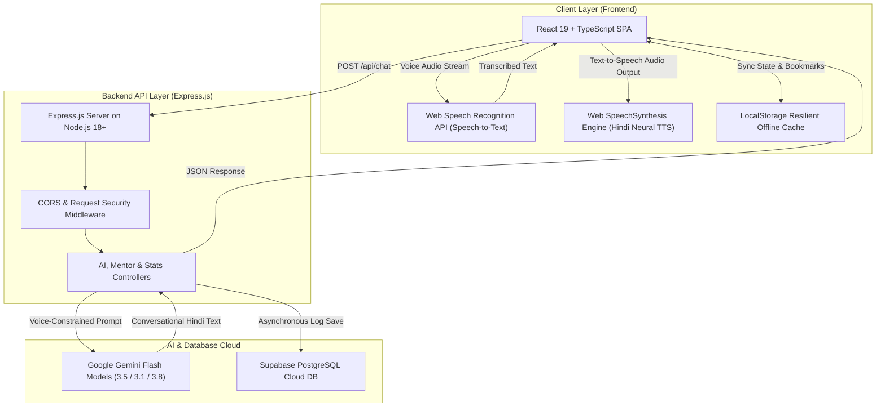

# 🎙️ PROJECT REPORT: GRAMVOICE AI
## Voice-First Fullstack AI Platform for Rural Indian Grassroots Entrepreneurs & MSMEs

---

**Project Title:** GramVoice AI  
**Document Version:** 1.0 (Production Release)  
**Classification:** Fullstack AI Engineering & Product Report  
**Target Audience:** Idea Lab Evaluators, Technical Interviewers, Project Evaluators, Stakeholders  
**Live Frontend Application:** [https://gram-voice-ai.vercel.app](https://gram-voice-ai.vercel.app)  
**Live Backend API Service:** [https://gramvoice-ai.onrender.com](https://gramvoice-ai.onrender.com)  
**GitHub Repository:** [https://github.com/anshjaiswal2911-tech/GramVoice-Ai](https://github.com/anshjaiswal2911-tech/GramVoice-Ai)  

---

## 📑 Table of Contents
1. [Executive Summary](#1-executive-summary)
2. [Problem Statement & Social Impact](#2-problem-statement--social-impact)
3. [Product Overview & Value Proposition](#3-product-overview--value-proposition)
4. [System Architecture & Data Flow](#4-system-architecture--data-flow)
5. [Fullstack Technology Stack](#5-fullstack-technology-stack)
6. [Core Module & Feature Breakdown](#6-core-module--feature-breakdown)
7. [Voice Pipeline & Audio Normalization Engineering](#7-voice-pipeline--audio-normalization-engineering)
8. [Database Architecture & Data Models](#8-database-architecture--data-models)
9. [REST API Architecture & Endpoints](#9-rest-api-architecture--endpoints)
10. [Security, Performance & Fault Tolerance](#10-security-performance--fault-tolerance)
11. [DevOps, CI/CD & Cloud Infrastructure](#11-devops-cicd--cloud-infrastructure)
12. [Future Roadmap & Conclusion](#12-future-roadmap--conclusion)

---

## 1. Executive Summary

**GramVoice AI** is an enterprise-grade, voice-first fullstack AI platform engineered to empower over **250 million rural and semi-urban Indian grassroots entrepreneurs**. The platform bridges the digital and linguistic divide by providing low-latency, dialect-tolerant voice assistance in Hindi and Indian English. 

Through an intuitive conversational interface, entrepreneurs can query business laws, discover matched government subsidies (e.g., PM Mudra, PM Vishwakarma, PMEGP), generate actionable business launch roadmaps, book verified 1-on-1 mentorship sessions, and track their business score on an interactive dashboard.

The application is built on a modern **Fullstack Monorepo Architecture** comprising a **React 19 + TypeScript + Tailwind CSS v4** frontend, a modular **Node.js + Express.js** backend microservice, **Google Gemini Flash** multi-model LLMs, and a **Supabase PostgreSQL** cloud database.

---

## 2. Problem Statement & Social Impact

### 2.1 The Core Problem
Over 65% of India's population resides in rural areas. While these regions possess high entrepreneurial potential in micro-manufacturing, food processing, agri-business, and local retail, entrepreneurs face critical hurdles:
1. **Linguistic & Literacy Barriers:** 80%+ of government portal forms, banking documentation, and compliance guides are written in formal bureaucratic English or complex text.
2. **Under-utilization of Subsidies:** Central and State Governments allocate thousands of crores in collateral-free loans and capital subsidies (e.g., 15-35% PMEGP subsidy, ₹10L Mudra loans), but grassroots entrepreneurs remain unaware or overwhelmed by the application steps.
3. **Geographic Isolation from Mentors:** Quality financial, compliance, and marketing advisory is heavily concentrated in Tier-1 metropolitan cities.

### 2.2 The GramVoice AI Solution
GramVoice AI replaces complex text portals with an **accessible, spoken voice interface**. Users simply press the microphone, speak in everyday conversational Hindi/Hinglish, and receive crystal-clear, step-by-step guidance spoken back to them with native Indian pronunciation.

---

## 3. Product Overview & Value Proposition

| Pillar | Feature Capability | User Value |
|---|---|---|
| **Voice AI Copilot** | Multilingual Speech-to-Text and Text-to-Speech in Devanagari Hindi and English | Zero typing required; fully accessible to semi-literate entrepreneurs. |
| **Government Schemes Engine** | Real-time catalog of 8+ verified national schemes with direct official portal integrations | Direct access to official portals (`udyamimitra.in`, `pmvishwakarma.gov.in`) with 1-click bookmarks. |
| **Business Idea Matcher** | Curated low-investment village business templates with equipment and profit breakdowns | Complete launch roadmaps and subsidy matching generated on demand. |
| **Mentorship Hub** | Directory of verified MSME, finance, marketing, and agri-business consultants | Direct 1-on-1 appointment booking persisted in Supabase database. |
| **Entrepreneur Dashboard** | Centralized analytics tracking voice query logs, bookmarked schemes, and readiness score | Complete oversight of business planning progress. |

---

## 4. System Architecture & Data Flow



### 4.1 End-to-End Request Lifecycle
1. **User Voice Input:** The user taps the microphone button. The browser's Web Speech Recognition captures spoken audio and transcribes it in real-time.
2. **API Dispatch:** The client dispatches a `POST` request to `/api/chat` with the query string and language code.
3. **AI Generation with Multi-Model Fallback:** The Express backend formats the request with strict voice-first system instructions and queries the Google Gemini Flash endpoint. If the primary model encounters rate limiting, fallback models take over seamlessly.
4. **Data Persistence:** The chat transaction is logged into the `voice_chats` table in Supabase PostgreSQL.
5. **Speech Synthesis:** The frontend receives the response, passes it through the custom **Voice Normalizer**, and synthesizes speech using the platform's native neural voice engine.

---

## 5. Fullstack Technology Stack

```
┌────────────────────────────────────────────────────────┐
│                   GRAMVOICE AI STACK                   │
├───────────────────┬────────────────────────────────────┤
│ Frontend Layer    │ React 19, TypeScript 5.7, Vite 8   │
│ Styling & UI      │ Tailwind CSS v4, Lucide Icons      │
│ Voice & Audio     │ Web Speech API (STT & TTS)         │
│ Backend Service   │ Node.js 18+, Express.js 5          │
│ AI Engine         │ Google Gemini 3.5 / 3.1 Flash      │
│ Database          │ Supabase (PostgreSQL 15)           │
│ Deployment        │ Vercel (Client) + Render (API)     │
└───────────────────┴────────────────────────────────────┘
```

### 5.1 Frontend Architecture
- **React 19 & TypeScript:** State-driven component architecture with strict typing.
- **Tailwind CSS v4:** Modern `@tailwindcss/vite` configuration for responsive mobile-first UI.
- **Client-Side Routing:** Dynamic tab routing (`landing`, `voice`, `schemes`, `ideas`, `mentor`, `dashboard`, `about`).

### 5.2 Backend Architecture
- **Modular MVC Pattern:** Dedicated separation into `controllers`, `routes`, `config`, and `middleware`.
- **High Concurrency:** Asynchronous, non-blocking I/O handling simultaneous voice requests.
- **Heartbeat Daemon:** Built-in 10-minute self-ping heartbeat to maintain zero cold-start on cloud containers.

---

## 6. Core Module & Feature Breakdown

### 6.1 Voice Assistant (`/voice`)
- **Dialect & Accent Tolerance:** Accommodates colloquial phrasing, phonetic typos, and mixed Hinglish questions.
- **Sentence Chunking:** Splits lengthy responses by punctuation (`।`, `.`, `?`) to initiate instant streaming playback without latency.
- **Interactive Controls:** Features `Listen/Stop Audio`, `Copy to Clipboard` with confirmation, and `Clear Chat` memory reset.

### 6.2 Government Schemes & Subsidies (`/schemes`)
- **Catalog of 8 National Schemes:**
  1. *PM Mudra Yojana* (Loans up to ₹10 Lakh collateral-free)
  2. *Stand Up India* (Loans ₹10 Lakh to ₹1 Crore for SC/ST & Women)
  3. *Startup India Seed Fund* (Up to ₹20 Lakh grants + ₹50 Lakh debt)
  4. *PM Vishwakarma Yojana* (Free training + ₹15,000 toolkit + ₹3 Lakh loan at 5%)
  5. *Mahila Udyam Nidhi* (Soft loans up to ₹10 Lakh for women enterprises)
  6. *PMEGP Scheme* (15% to 35% capital subsidy up to ₹50 Lakh)
  7. *Agri Infrastructure Fund* (Loans up to ₹2 Crore with 3% interest subvention)
  8. *MSME ASPIRE Scheme* (Incubation support up to ₹1 Crore)
- **Direct Official Portal Redirection:** Direct hyperlinks to official portals (`udyamimitra.in`, `pmvishwakarma.gov.in`, `standupmitra.in`, etc.).
- **Live Bookmarking (`★`):** Users can save schemes to their database with instant toast notifications.

### 6.3 Rural Business Opportunities (`/ideas`)
- **Curated Business Models:** Low-investment ideas including Vermicompost, Mobile Repair Shop, Homestay Agri-Tourism, CSC Digital Seva Kendra, Artisanal Pickles/Papad, and Custom Tailoring.
- **Live Search Bar:** Real-time keyword filtering across title, description, and required equipment.
- **AI Roadmap Generator:** 1-tap generation of customized capital breakdown, equipment list, marketing tips, and applicable subsidies.

### 6.4 Verified Mentor Hub (`/mentor`)
- **Expert Profiles:** Industry mentors across Business Strategy, Finance, Digital Marketing, Agriculture, and Technology.
- **Interactive Booking Modal:** Validated user inputs (Full Name, Phone/WhatsApp, Preferred Time Slot, and Business Sawaal) committed to Supabase `mentor_bookings`.

### 6.5 Entrepreneur Analytics Dashboard (`/dashboard`)
- **Dynamic Business Score:** Calculated based on conversation count and scheme bookmarks.
- **Saved Schemes Grid:** Direct management of bookmarked schemes with 1-click AI consultation or removal.
- **Confirmed Mentorship Sessions:** Overview of upcoming advisory appointments.

---

## 7. Voice Pipeline & Audio Normalization Engineering

To ensure seamless audio playback across Android, iOS, and desktop browsers, GramVoice AI utilizes a custom **Voice Normalization Pipeline**:

```
[Raw Gemini AI Text]
        │
        ▼
[Currency Normalizer]      ───> Converts "₹50,000" to "50,000 रुपये"
        │
        ▼
[Abbreviation Expander]    ───> Expands "MSME" -> "एम एस एम ई", "GST" -> "जी एस टी"
        │
        ▼
[Markdown/Symbol Stripper] ───> Removes "*", "#", "_", tables, emojis, URLs
        │
        ▼
[Sentence Stream Splitter] ───> Chunks text by "।", ".", "?", "!"
        │
        ▼
[Web SpeechSynthesis API]  ───> High-fidelity playback via Google/Apple Neural Hindi Voices
```

---

## 8. Database Architecture & Data Models

The database is built on **Supabase PostgreSQL 15** with Row-Level Security (RLS) and real-time query support.

### 8.1 Schema Definitions

```sql
-- 1. Voice Interaction Logs
CREATE TABLE voice_chats (
    id UUID DEFAULT gen_random_uuid() PRIMARY KEY,
    session_id TEXT,
    user_message TEXT NOT NULL,
    ai_response TEXT NOT NULL,
    language VARCHAR(10) DEFAULT 'hi-IN',
    created_at TIMESTAMP WITH TIME ZONE DEFAULT NOW()
);

-- 2. Mentorship Consultation Appointments
CREATE TABLE mentor_bookings (
    id UUID DEFAULT gen_random_uuid() PRIMARY KEY,
    mentor_name TEXT NOT NULL,
    user_name TEXT NOT NULL,
    phone_number TEXT NOT NULL,
    business_type TEXT DEFAULT 'Rural Business',
    booking_date DATE NOT NULL,
    time_slot TEXT NOT NULL,
    status VARCHAR(20) DEFAULT 'Confirmed',
    created_at TIMESTAMP WITH TIME ZONE DEFAULT NOW()
);

-- 3. Saved Government Schemes & Subsidies
CREATE TABLE saved_schemes (
    id UUID DEFAULT gen_random_uuid() PRIMARY KEY,
    scheme_id TEXT NOT NULL,
    scheme_name TEXT NOT NULL,
    category VARCHAR(50),
    created_at TIMESTAMP WITH TIME ZONE DEFAULT NOW()
);
```

---

## 9. REST API Architecture & Endpoints

Base URL (Production): `https://gramvoice-ai.onrender.com`

| Method | Route | Purpose | Payload Example | Success Response (200 OK) |
|---|---|---|---|---|
| `GET` | `/api/health` | Health & connection diagnostics | None | `{"success": true, "status": "healthy", "apiKeyConfigured": true, "databaseConnected": true}` |
| `POST` | `/api/chat` | AI query generation & chat logging | `{"message": "Mudra loan kaise le?", "language": "hi-IN"}` | `{"success": true, "reply": "PM Mudra Yojana me ₹10 Lakh tak loan..."}` |
| `GET` | `/api/history` | Retrieve conversation history | None | `{"success": true, "history": [...]}` |
| `POST` | `/api/bookings` | Book mentor consultation | `{"mentor_name": "Priya Sharma", "user_name": "Ramesh", "phone_number": "9876543210", ...}` | `{"success": true, "message": "Mentor session booked successfully"}` |
| `GET` | `/api/bookings` | Retrieve scheduled bookings | None | `{"success": true, "bookings": [...]}` |
| `GET` | `/api/stats` | Aggregated dashboard statistics | None | `{"success": true, "stats": {"totalQuestions": 45, "schemesBookmarked": 8, ...}}` |

---

## 10. Security, Performance & Fault Tolerance

1. **Dual-Layer Caching (Offline Resilience):** Every database mutation is mirrored in `localStorage` first. If network latency or offline mode occurs, the app operates uninterrupted and syncs back upon reconnection.
2. **CORS Whitelisting:** Production origins are strictly restricted to authorized Vercel domains (`https://gram-voice-ai.vercel.app`) and local development ports.
3. **Environment Variable Hygiene:** All sensitive API keys (`GEMINI_API_KEY`, `SUPABASE_SERVICE_ROLE_KEY`) are managed via environment secrets and excluded from version control.

---

## 11. DevOps, CI/CD & Cloud Infrastructure

- **Frontend CI/CD:** Hosted on **Vercel** with automatic branch deployments on GitHub `push to main`.
- **Backend Service:** Hosted on **Render** utilizing Docker containerization with automated environment orchestration.
- **Database Engine:** Hosted on **Supabase Cloud (AWS ap-south-1 Mumbai region)** ensuring minimal database latency for Indian users.

---

## 12. Future Roadmap & Conclusion

### 12.1 Planned Enhancements
- **WhatsApp Bot Integration:** Allow rural users to send voice notes on WhatsApp and receive automated voice replies.
- **Dialect Expansion:** Addition of 10+ regional dialects including Bhojpuri, Maithili, Marathi, Gujarati, Telugu, and Bengali.
- **Document OCR Scanning:** Camera-based Aadhaar, PAN, and DPR document analyzer to automatically fill government scheme forms.

### 12.2 Conclusion
GramVoice AI demonstrates that cutting-edge generative AI, coupled with intuitive voice engineering and robust fullstack architecture, can solve profound grassroots socio-economic challenges. By providing equal access to business knowledge, subsidies, and mentors, GramVoice AI paves the way for a more inclusive, entrepreneurial India.

---

**Report Prepared by:** GramVoice AI Engineering Team  
**Repository:** [https://github.com/anshjaiswal2911-tech/GramVoice-Ai](https://github.com/anshjaiswal2911-tech/GramVoice-Ai)
