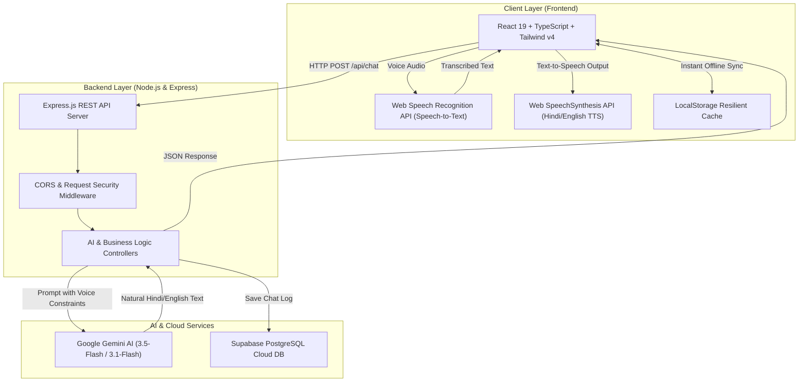

# 🎙️ GramVoice AI — Voice-First AI Copilot for Rural Indian Entrepreneurs

[](https://react.dev/)
[](https://www.typescriptlang.org/)
[](https://tailwindcss.com/)
[](https://nodejs.org/)
[](https://expressjs.com/)
[](https://supabase.com/)
[](https://ai.google.dev/)
[](https://gram-voice-ai.vercel.app)
[](https://gramvoice-ai.onrender.com)
[](LICENSE)

> **Empowering 250M+ rural and semi-urban Indian grassroots entrepreneurs through conversational voice AI in regional languages, tailored government scheme discovery, business planning roadmaps, and verified 1-on-1 mentorship.**

---

## 🔗 Live Deployments & Demos

| Component | Platform | Status | URL |
|---|---|---|---|
| **Frontend Web Application** | Vercel | 🟢 Live & Production-Ready | [https://gram-voice-ai.vercel.app](https://gram-voice-ai.vercel.app) |
| **Backend REST API** | Render | 🟢 Live (Cloud Web Service) | [https://gramvoice-ai.onrender.com](https://gramvoice-ai.onrender.com) |
| **API Health Diagnostics** | Render | 🟢 Active | [https://gramvoice-ai.onrender.com/api/health](https://gramvoice-ai.onrender.com/api/health) |
| **Relational Database** | Supabase | 🟢 PostgreSQL Cloud | Cloud Hosted |

---

## 🌟 The Problem & Solution

### 🚨 The Problem
Over **65% of India's population** lives in rural and semi-urban regions. While there is tremendous entrepreneurial ambition in agriculture, handicrafts, retail, and local services, rural entrepreneurs face major systemic roadblocks:
- **Language & Literacy Barriers:** Most digital business portals and banking websites are available primarily in complex English or formal bureaucratic text.
- **Fragmented Government Schemes:** Millions of rupees in subsidized loans and grants (e.g., PM Mudra, PMEGP, PM Vishwakarma) go unclaimed because small business owners do not know how to apply or what documents are needed.
- **Lack of Affordable Mentorship:** Access to verified financial advisors and business mentors is concentrated in Tier-1 metro cities.

### 💡 The Solution: GramVoice AI
**GramVoice AI** provides a **zero-friction, voice-first AI copilot** that speaks and understands natural Hindi, Hinglish, and Indian English. Any entrepreneur can simply speak into their phone, receive instant business guidance, discover relevant government subsidies, generate step-by-step launch plans, book verified mentor sessions, and track their business score on an interactive dashboard.

---

## 🏛️ System Architecture



---

## 🚀 Key Features

### 1. 🎙️ Multilingual Voice Assistant (`/voice`)
- **Speech-to-Text:** Live mic listening with automatic silence detection and support for Indian accents and colloquial Hinglish.
- **Smart Speech Synthesis:** High-clarity native Hindi voice playback with automated number conversion (e.g., `₹50,000` -> `50,000 रुपये`) and acronym expansion (`MSME` -> `एम एस एम ई`).
- **Resilient AI Fallback:** Automated fallback across Google Gemini Flash models (`gemini-3.5-flash-lite`, `gemini-3.1-flash-lite`, `gemini-3.8-flash`) with sub-second response times.
- **Copy & Clear Tools:** 1-click clipboard copy with visual checkmark feedback and full conversation reset.

### 2. 🏛️ Government Schemes & Subsidies Explorer (`/schemes`)
- **Verified National Schemes:** Curated catalog spanning **PM Mudra Yojana**, **PM Vishwakarma**, **Stand-Up India**, **PMEGP**, **Startup India Seed Fund**, **Agri Infrastructure Fund**, **Mahila Udyam Nidhi**, and **MSME ASPIRE**.
- **Official Application Portals:** Direct 1-click links to verified government portals (`udyamimitra.in`, `pmvishwakarma.gov.in`, `standupmitra.in`, `kviconline.gov.in`).
- **Database Bookmarking (`★`):** Save schemes directly to Supabase with real-time feedback and quick access from the dashboard.
- **Step-by-Step AI Guidance:** Ask GramVoice AI to explain eligibility, documentation checklist, and form submission for any scheme.

### 3. 💡 Rural Business Opportunities & Roadmap Generator (`/ideas`)
- **Curated Business Models:** Low-investment ideas including Organic Vermicompost, Mobile Repair Hub, Agri-Tourism Homestays, CSC Digital Seva Kendras, Artisanal Food Processing, and Custom Tailoring.
- **Live Search & Filter:** Search by keyword, required capital, difficulty, or industry category.
- **AI Launch Roadmaps:** 1-tap generation of customized capital expenditure plans, tool shopping lists, marketing strategies, and applicable government subsidies.

### 4. 🤝 Verified Mentor Booking System (`/mentor`)
- **Expert Directory:** Verified advisors in Business Strategy, Micro-Finance, Digital Marketing, Agri-Business, and Technology.
- **Interactive Consultation Booking:** Pick date and time slots, enter topic and contact details, and persist bookings to Supabase PostgreSQL database.
- **AI Mentorship Advice:** Instant AI chat tailored to each mentor's domain of expertise.

### 5. 📊 Entrepreneur Dashboard (`/dashboard`)
- **Dynamic Business Metrics:** Real-time calculation of voice queries asked, saved government schemes, confirmed mentor consultations, and business readiness score.
- **Saved Schemes Management:** 1-click AI consultation or bookmark removal for saved government schemes.
- **Conversation & Booking History:** Chronological overview of recent voice queries and mentorship appointments.

---

## 📂 Project Structure

```
GramVoice-Ai/
├── backend/                       # 🟢 Standalone Node.js & Express.js REST API
│   ├── src/
│   │   ├── config/
│   │   │   └── supabase.js        # Supabase PostgreSQL connection & credentials
│   │   ├── controllers/
│   │   │   ├── aiController.js    # Gemini LLM orchestration & chat logging
│   │   │   ├── mentorController.js# Mentorship scheduling business logic
│   │   │   └── statsController.js # Aggregated analytics & stats
│   │   ├── middleware/
│   │   │   └── cors.js            # CORS policy & security headers
│   │   ├── routes/
│   │   │   ├── aiRoutes.js        # /api/chat, /api/history
│   │   │   ├── mentorRoutes.js    # /api/bookings
│   │   │   ├── statsRoutes.js     # /api/stats
│   │   │   └── healthRoutes.js    # /api/health
│   │   └── app.js                 # Express Application instance
│   ├── server.js                  # Backend server entrypoint & keep-alive
│   ├── package.json               # Backend dependencies
│   ├── .env.example               # Backend environment variables template
│   └── README.md                  # Backend API documentation
│
├── src/                           # 🔵 React 19 + Vite Frontend Application
│   ├── lib/
│   │   └── supabase.ts            # Supabase TypeScript client & fallback storage
│   ├── App.tsx                    # Core application layout, router & page views
│   ├── main.tsx                   # React root entrypoint
│   ├── index.css                  # Tailwind CSS v4 styling & animations
│   └── vite-env.d.ts              # TypeScript environment declarations
│
├── supabase/                      # 🗄️ Database Schemas & Migrations
│   └── schema.sql                 # PostgreSQL tables (voice_chats, mentor_bookings, saved_schemes)
│
├── public/                        # Static assets (favicons, manifest, icons)
├── package.json                   # Frontend dependencies & build scripts
├── vite.config.ts                 # Vite 8 + Tailwind v4 + React configuration
├── tsconfig.json                  # TypeScript configuration
├── vercel.json                    # Vercel deployment routing
└── README.md                      # Master repository documentation
```

---

## 🛠️ Technology Stack

| Layer | Technology | Purpose |
|---|---|---|
| **Frontend Framework** | **React 19** | Modern reactive component architecture |
| **Language** | **TypeScript 5.7** | Type safety, maintainability, and clean interfaces |
| **Styling** | **Tailwind CSS v4** | Modern utility-first CSS design and animations |
| **Build Tooling** | **Vite 8** | Lightning-fast development server and optimized bundle build |
| **Backend Framework** | **Express.js 5 / Node.js 18+** | High-performance RESTful API microservice |
| **AI / LLM Engine** | **Google Gemini Flash** | Ultra-fast Hindi/English multilingual reasoning |
| **Database** | **Supabase (PostgreSQL)** | Relational database, analytics, and booking records |
| **Voice Processing** | **Web Speech API** | Native in-browser Speech-to-Text & Text-to-Speech |
| **Frontend Hosting** | **Vercel** | Global Edge CDN deployment with automatic CI/CD |
| **Backend Hosting** | **Render** | Production containerized cloud web service |

---

## 🗄️ Database Schema (PostgreSQL / Supabase)

### 1. `voice_chats`
Logs user queries and AI responses for conversation history:
```sql
CREATE TABLE voice_chats (
  id UUID DEFAULT gen_random_uuid() PRIMARY KEY,
  session_id TEXT,
  user_message TEXT NOT NULL,
  ai_response TEXT NOT NULL,
  language VARCHAR(10) DEFAULT 'hi-IN',
  created_at TIMESTAMP WITH TIME ZONE DEFAULT NOW()
);
```

### 2. `mentor_bookings`
Stores 1-on-1 entrepreneur consultation bookings:
```sql
CREATE TABLE mentor_bookings (
  id UUID DEFAULT gen_random_uuid() PRIMARY KEY,
  mentor_name TEXT NOT NULL,
  user_name TEXT NOT NULL,
  phone_number TEXT NOT NULL,
  business_type TEXT DEFAULT 'Rural Business',
  booking_date DATE NOT NULL,
  time_slot TEXT NOT NULL,
  status VARCHAR(20) DEFAULT 'Confirmed',
  created_at TIMESTAMP WITH TIME ZONE DEFAULT NOW()
);
```

### 3. `saved_schemes`
Tracks bookmarked government schemes and subsidies:
```sql
CREATE TABLE saved_schemes (
  id UUID DEFAULT gen_random_uuid() PRIMARY KEY,
  scheme_id TEXT NOT NULL,
  scheme_name TEXT NOT NULL,
  category VARCHAR(50),
  created_at TIMESTAMP WITH TIME ZONE DEFAULT NOW()
);
```

---

## 📡 REST API Reference

| HTTP Method | Route | Description | Request Body (JSON) | Response (JSON) |
|---|---|---|---|---|
| `GET` | `/api/health` | Health check and connectivity diagnostics | None | `{ "success": true, "status": "healthy", "apiKeyConfigured": true, "databaseConnected": true }` |
| `POST` | `/api/chat` | Send user query to Gemini Flash AI | `{ "message": "PM Mudra loan kaise milega?", "language": "hi-IN" }` | `{ "success": true, "reply": "PM Mudra Yojana me ₹10 Lakh tak collateral-free loan milta hai..." }` |
| `GET` | `/api/history` | Fetch last 20 voice conversation logs | None | `{ "success": true, "history": [...] }` |
| `POST` | `/api/bookings` | Book a mentor consultation session | `{ "mentor_name": "Priya Sharma", "user_name": "Ramesh", "phone_number": "+91 9876543210", "booking_date": "2026-09-28", "time_slot": "11:00 AM" }` | `{ "success": true, "message": "Mentor session booked successfully" }` |
| `GET` | `/api/bookings` | List all mentor bookings | None | `{ "success": true, "bookings": [...] }` |
| `GET` | `/api/stats` | Fetch aggregated dashboard analytics | None | `{ "success": true, "stats": { "totalQuestions": 45, "schemesBookmarked": 8, "mentorsConnected": 3, "businessScore": 84 } }` |

---

## 💻 Local Setup & Installation

### Prerequisites
- **Node.js**: v18.0.0 or higher
- **npm** or **pnpm**
- **Git**
- Free Google Gemini API Key from [Google AI Studio](https://aistudio.google.com/)
- (Optional) Free Supabase project from [supabase.com](https://supabase.com/)

---

### Step 1: Clone the Repository
```bash
git clone https://github.com/anshjaiswal2911-tech/GramVoice-Ai.git
cd GramVoice-Ai
```

---

### Step 2: Backend Setup
```bash
cd backend
npm install

# Create .env file
cp .env.example .env
```

Edit `backend/.env`:
```env
PORT=5000
GEMINI_API_KEY=your_actual_gemini_api_key
SUPABASE_URL=https://zjgrhlzpiqlldgqozrsz.supabase.co
SUPABASE_SERVICE_ROLE_KEY=your_supabase_service_role_key
SUPABASE_ANON_KEY=your_supabase_anon_key
FRONTEND_URL=http://localhost:5173
```

Start the backend server:
```bash
npm run dev
# Server starts on http://localhost:5000
```

---

### Step 3: Frontend Setup
Open a new terminal window in the root directory:
```bash
# Install frontend dependencies
npm install

# Start Vite development server
npm run dev
# App opens on http://localhost:5173
```

---

## 🚢 Deployment Guide

### Deploying Frontend to Vercel
1. Import the GitHub repository into [Vercel](https://vercel.com).
2. Framework Preset: **Vite**.
3. Environment Variables:
   - `VITE_API_URL`: `https://gramvoice-ai.onrender.com` (or your backend URL)
   - `VITE_SUPABASE_URL`: Your Supabase Project URL
   - `VITE_SUPABASE_ANON_KEY`: Your Supabase Anon Key
4. Click **Deploy**.

### Deploying Backend to Render
1. Create a new **Web Service** on [Render](https://render.com).
2. Connect your GitHub repository.
3. Root Directory: `backend` (or `server`).
4. Build Command: `npm install`
5. Start Command: `npm start`
6. Environment Variables: Add `GEMINI_API_KEY`, `SUPABASE_URL`, `SUPABASE_SERVICE_ROLE_KEY`, `FRONTEND_URL`.

---

## 📈 Roadmap & Upcoming Features
- [x] Fullstack architecture with modular Express backend and React 19 frontend
- [x] Dual-language voice assistant (Hindi & English) with Hindi speech synthesis
- [x] Supabase PostgreSQL database integration for voice chats, bookmarks, and bookings
- [x] Real official government scheme application portal links
- [ ] Direct WhatsApp integration via WhatsApp Cloud API for voice note consultations
- [ ] Offline PWA (Progressive Web App) support for remote rural connectivity
- [ ] Expansion to 12+ Indian regional dialects (Bhojpuri, Marathi, Bengali, Tamil, Telugu, Gujarati)

---

## 📄 License

This project is licensed under the **MIT License** — see the [LICENSE](LICENSE) file for details.

---

<p align="center">
  Built with ❤️ for Indian Grassroots Entrepreneurs & MSMEs.<br />
  <strong>GramVoice AI — Empowering Rural India, One Voice at a Time.</strong>
</p>
